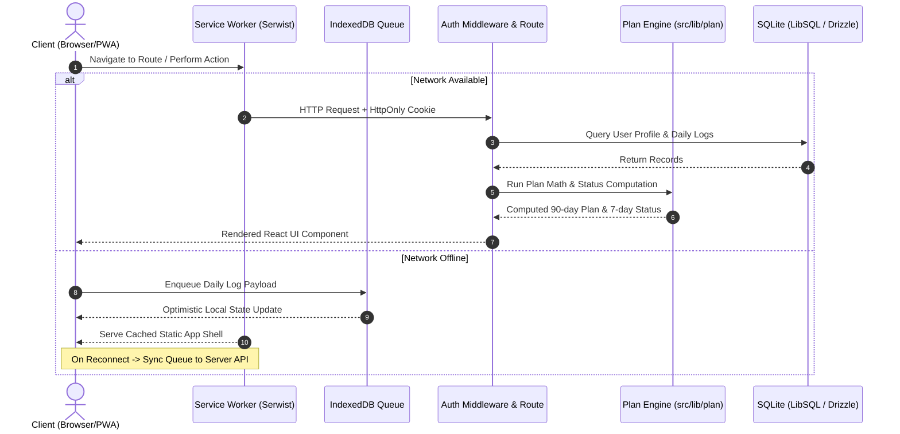

# Cut 90 Planner - System Architecture & Engineering Specification

This document details the software architecture, data modeling, offline sync queue, and Progressive Web App (PWA) caching strategy of Cut 90 Planner.

---

## 1. Directory Structure Map

```
Cut90_Planner/
├── .github/workflows/ci.yml       # GitHub Actions CI/CD Pipeline
├── public/
│   ├── openapi.json               # OpenAPI 3.0 API Schema (616 lines)
│   ├── swagger.html               # Swagger UI Viewer
│   └── manifest.webmanifest       # PWA Application Manifest
├── src/
│   ├── app/                       # Next.js App Router Routes
│   │   ├── (auth)/                # Authentication Group (/login, /register)
│   │   ├── api/                   # REST API Handlers (13 endpoints)
│   │   ├── help/                  # Help Center, Glossary & FAQ
│   │   ├── onboarding/            # 4-step Profile Setup Stepper
│   │   ├── plan/                  # 90-Day Schedule Table View
│   │   ├── setup/                 # Settings, Recalibration & Account
│   │   ├── trend/                 # Weight Trend SVG Chart & Weekly Table
│   │   ├── globals.css            # Global CSS Variables & Token Theme
│   │   └── layout.tsx             # Root Layout with Font Loaders
│   ├── components/
│   │   ├── ui/                    # Reusable Design System Primitives
│   │   ├── layout/                # NavLayout, Header, BottomNav, OfflineIndicator
│   │   ├── today/                 # StatusCard, MacroBars, LogForm
│   │   ├── plan/                  # PlanTable
│   │   ├── trend/                 # WeightChart, WeeklyTable
│   │   └── setup/                 # ProfileForm, AccountSection, DataSection
│   ├── lib/
│   │   ├── db/                    # Drizzle ORM + LibSQL SQLite Client
│   │   ├── offline/               # IndexedDB Offline Log Queue
│   │   ├── plan/                  # Calculation Engine & Types
│   │   └── auth.ts                # Argon2 Password & Cookie Session Manager
│   └── tests/                     # Vitest Unit & Integration Suites
├── docs/                          # Comprehensive Project Documentation
├── migrations/                    # Drizzle SQL Database Migrations
├── scripts/                       # Maintenance, Seed & Screenshot Scripts
├── tailwind.config.ts             # Custom Design Tokens & Typography
└── vitest.config.ts               # Vitest Configuration with Single Fork
```

---

## 2. System Architecture & Request Flow



---

## 3. Database Schema & Data Model Diagram

```mermaid
erDiagram
    USERS ||--o1 PROFILES : owns
    USERS ||--o{ DAILY_LOGS : records
    USERS ||--o{ SESSIONS : maintains

    USERS {
        string id PK
        string username UK
        string password_hash
        number created_at
        number updated_at
    }

    PROFILES {
        string user_id FK, PK
        string sex
        number age
        number height_cm
        number start_weight
        number goal_weight
        string activity
        string start_date
        number protein_g_per_kg
        number fat_g_per_kg
        number recal_day
        number recal_weight
        number updated_at
    }

    DAILY_LOGS {
        string id PK
        string user_id FK
        number day UK_user_day
        number weight_kg
        number protein_g
        number carb_g
        number fat_g
        number waist_cm
        number updated_at
    }

    SESSIONS {
        string id PK
        string user_id FK
        number expires_at
    }
```

---

## 4. Offline Queue & Sync Architecture

1. **Local Enqueue**: When the client loses connectivity, daily weight and macro logs are serialized and written to IndexedDB store `cut90_offline_queue` via `idb`.
2. **Optimistic Updates**: The UI immediately reflects saved state and displays `Toast` in `offline` mode.
3. **Automatic Re-sync**: A global `online` event listener in `OfflineIndicator` triggers `flushOfflineQueue()`, iterating through queued payloads and sending `PUT /api/logs/:day` requests sequentially.

---

## 5. PWA Caching Strategy

Managed via `@serwist/next` in `src/app/sw.ts`:
* **App Shell (HTML/CSS/JS)**: Cache-First / Precached assets for instant startup (< 200ms).
* **API Endpoints (`/api/*`)**: Network-Only (bypasses service worker cache to ensure data freshness).
* **Static Assets (Fonts, Icons)**: Cache-First with 30-day expiration.
